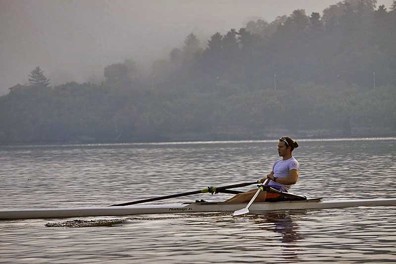

Every year the London marathon raises approximately £65 million for UK based charities. With this year’s event cancelled, the new [#TwoPointSixChallenge](https://www.twopointsixchallenge.co.uk/) has taken its place with the aim of getting 2.6million of us raising money this week. This can be doing absolutely anything as long as it’s got something to do with the number 2.6 or 26.

We thought this would be a perfect opportunity to help people support charities during this tough time, while pushing ourselves and having fun doing it. That’s why we’ve created this rowing workout.

All you need is a rowing machine and 26 minutes.

### Why Rowing?

Rowing is one of the most efficient ways to keep fit thanks to its ability to target 85% of your body’s muscles with each and every stroke. Use good technique and all major muscles get an intense workout, meaning you’ll increase strength as well as your cardiovascular capacity.

* That’s right. Cardio and strength building at the same time.

* On top of that, rowing machines are low impact. So you can work out at high intensity while minimising risk of injury.

* It’s pretty clear. Rowing is a fantastic exercise for keeping in shape. What’s even better? Mixing rowing into a full-body circuit workout.

### The #TwoPointSixChallenge Rowing Workout

We’re going to be doing a full body workout by incorporating rowing with some circuit based exercises. All you need is a rowing machine and enough space that you don’t bump into anything.

This is a tough routine which should push your limits so if there’s any exercises you’re not comfortable with you can swap them out with a different one, just make sure it targets the same body part.

The whole routine including rest periods should take you an estimated 26 minutes (hence the 2.6 challenge 😉). Don’t worry if it takes you longer.

#### Warm Up

Start off with a steady 4 minute workout, focusing on getting the whole body moving and refining your technique to make sure you’re ready once the real rowing begins. Make sure to sit up tall, using your legs to start the drive, lean your body back with your arms pulling through. Do the exact opposite as you return back in, arms first then the body and then the legs.

Keep it smooth and steady, gradually increasing your strokes per minute (SPM) each minute by pushing more power through your legs. This’ll get the blood pumping and your heart rate up. On the fourth and final minute of the warm up relax a little so you’re ready for your first interval.

> 1 minute light rowing at 18 SPM.

> 1 minute medium rowing at 22 SPM.

> 1 minute harder rowing at 26 SPM.

> 1 minute light rowing at 18 SPM.

#### Interval 1

For your first interval, you’re going to be mixing powerful bursts of rowing with short rest periods. It’s going to be three sets of 100 meter sprints (row as fast as you can) with 30 second rest periods.

As always, maintain strong form. Sit up tall and strong. Push for long strokes, driving through the legs, with big deep breaths.

> Row 100 meters as fast as you can.

> Rest for 30 seconds.

> Row 100 meters as fast as you can.

> Rest for 30 seconds.

> Row 100 meters as fast as you can.

> Rest for 30 seconds.

#### Interval 2

Once you’re ready move onto the second interval. Here you’re going to be rowing hard, but steady. These rows are more about consistency rather than going as fast as you can. Once you’ve completed 30 seconds at 28 SPM, hop off the rowing machine and complete 20 squat jumps (if you’re not comfortable doing squat jumps at this stage, swap these out for normal shoulder width squats). Repeat this two times.

Once you’ve done three sets, catch your breath and do a 60 second plank. Keep your body long and flat, make sure your hips dont lift. If you want to make this a little easier you can drop to your knees while keeping your core engaged.

> 30 seconds hard rowing at 28 SPM.

> 20 squat jumps.

> 30 seconds hard rowing at 28 SPM.

> 20 squat jumps.

> 30 seconds hard rowing at 28 SPM.

> 20 squat jumps.

> Plank for 60 seconds.

> Rest for 60 seconds.

#### Interval 3

We’re going to continue working the core in this third interval by alternating 30 seconds of hard rowing at 28 SPM with 20 twist crunches. Try to use this step as a bit of a recovery for your legs, and repeat for a total of 3 sets before moving on to your fourth and final interval.

>30 seconds hard rowing at 28 SPM.

>20 twist crunches.

>30 seconds hard rowing at 28 SPM.

>20 twist crunches.

>30 seconds hard rowing at 28 SPM.

>20 twist crunches.

>Rest for 60 seconds.

#### Interval 4

This one’s simple. Step back onto the rowing machine and alternate 20 seconds of fast, strong rowing with 20 seconds of light rowing. Repeat and then do a medium intensity row for a further 20 seconds.

If you’ve still got it in you, finish off your whole body with 10 burpees.

> 20 seconds very hard rowing at 30 SPM.

> 20 seconds light rowing at 20 SPM.

> 20 seconds very hard rowing at 30 SPM.

> 20 seconds light rowing at 20 SPM.

> 20 seconds medium rowing at 24 SPM.

> 10 burpees

#### Cool Down

That’s all the hard work done, lets relax the body with a very light 60 second row. Try to loosen up all your muscles, while maintaining your technique. Remember to stretch out with at least a [hamstring stretch](https://www.medicalnewstoday.com/articles/323703) and a [glute stretch](https://www.youtube.com/watch?v=gE6mJ0VjK7Y).

> 60 seconds light row.

> Glute stretch.

> Hamstring stretch.

And we are done!

